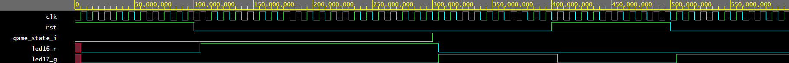

---

   # - VHDL 7-Segment Snake -
---

<pre>                  
⠀⠀⠀⠀⠀⠀⠀⠀⠀⠀⠀⠀⢀⣀⣀⣀⣀⣀⣀⣀⣀⣀⠀⠀⠀⠀⠀⠀⠀⠀
⠀⠀⠀⠀⠀⠀⠀⠀⠀⣠⣶⣿⣿⣿⣿⣿⣿⣿⣿⣿⡉⠙⣻⣷⣶⣤⣀⠀⠀⠀
⠀⠀⠀⠀⠀⠀⠀⠀⣼⣿⣿⣿⡿⠋⠀⠀⠀⠀⢹⣿⣿⡟⠉⠉⠉⢻⡿⠀⠀⠀    University team project:
⠀⠀⠀⠀⠀⠀⠀⠰⣿⣿⣿⣿⠀⠀⠀⠀⠀⠀⠀⣿⣿⣇⠀⠀⠀⠈⠇⠀⠀⠀        Snake game logic written
⠀⠀⠀⠀⠀⠀⠀⠀⢿⣿⣿⣿⣷⣄⠀⠀⠀⠀⠀⠉⠛⠿⣷⣤⡤.⠀⠀⠀⠀⠀     in VHDL using a 7-segment
⠀⠀⠀⠀⠀⠀⠀⠀⠈⠻⣿⣿⣿⣿⣿⣶⣦⣤⣤⣀⣀⣀.⡀⠉⠀⠀⠀⠀⠀⠀      display output.
⠀⠀⠀⠀⠀⠀⠀⠀⠀⠀⠈⠙⠻⢿⣿⣿⣿⣿⣿⣿⣿⣿⣿⣿⣦⡀⠀⠀⠀⠀
⠀⠀⠀⢀⣀⣤⣄⣀⠀⠀⠀⠀⠀⠀⠀⠉⠉⠙⠛⠿⣿⣿⣿⣿⣿⣿⣦⠀⠀⠀   
⠀⠀⣰⣿⣿⣿⣿⣿⣷⣤⡀⠀⠀⠀⠀⠀⠀⠀⠀⠀⠀⠙⢿⣿⣿⣿⣿⣧  ⠀   Language: VHDL
⠀⠀⣿⣿⣿⠁⠀⠈⠙⢿⣿⣦⣄⠀⠀⠀⠀⠀⠀⠀⠀⠀⠀⢻⣿⣿⣿⣿⠀⠀    Development Environment: Vivado / VS Code   
⠀⠀⢿⣿⣿⣆⠀⠀⠀⠀⠈⠛⠿⣿⣶⣦⡤⠴⠀⠀⠀⠀⠀⣸⣿⣿⣿⡿⠀⠀    Target Board:  Nexys A7-50T 
⠀⠀⠈⢿⣿⣿⣷⣄⡀⠀⠀⠀⠀⠀⠀⠀⠀⠀⠀⠀⠀⠀⣰⣿⣿⣿⣿⠃⠀⠀        
⠀⠀⠀⠀⠙⢿⣿⣿⣿⣶⣦⣤⣀⣀⡀⠀⠀⠀⣀⣠⣴⣾⣿⣿⣿⡿⠃⠀⠀⠀       
⠀⠀⠀⠀⠀⠀⠈⠙⠻⠿⣿⣿⣿⣿⣿⣿⣿⣿⣿⣿⣿⣿⡿⠟⠋⠀⠀⠀⠀⠀   VUT Brno University of Technology 
⠀⠀⠀⠀⠀⠀⠀⠀⠀⠀⠀⠈⠉⠙⠛⠛⠛⠛⠛⠛⠉⠁⠀⠀⠀⠀⠀⠀⠀      
⠀
</pre>
---
## Team Members :
* [Balaniuk Artem](https://github.com/artembal27104-beep)
* [Dulesov Gleb](https://github.com/glebdulesov-alt)
* [Matros Tymofii](https://github.com/Tymofii-Matros)
* [Yeriemieiev Daniil](https://github.com/daniil-yeriemieiev)
---
> [!IMPORTANT]
> ### Our Goal :
> Implementation of the classic Snake game logic using VHDL on the Nexys A7-50T. The game uses 8-digit 7-segment displays as play field

---

## Base Functions :
* **Movement Control:** (BTNU, BTND, BTNL, BTNR) Buttons to control snake
* **Reset:** (BTNC) Central button to restart the game
* **Scoring:** The snake grows in length as time passes, tracked by counter
* **Collision Detection/Game End:** Game ends when: Snake bites own tail or borders outside map
---
## Schematic:

---

> [!WARNING]
> The scheme will be further refined, and all simulation results will be added at a later date. 

## Design Description :

---
### 1. Clock Domains ([`clk_en`](snake/snake.srcs/sources_1/imports/new/clk_en.vhd))

 > [!NOTE]
 > About : The main clock divided to 3 domains using `clk_en` modules

####  Display Multiplexing
| Parameter | Target Signal | Period | Role |
| :---: | :---: | :---: | :---: |
| `G_MAX=100_000` | `sig_en_mux` | 1 ms | Switch between 8 anodes for dynamic 7-seg display  |

#### Snake Movement Speed
| Parameter | Target Signal | Period | Role |
| :---: | :---: | :---: | :---: |
| `G_MAX=200_000_000` | `sig_en_speed` | 2 s| Update snake's head coordinates |

#### Length & Score Timer
| Parameter | Target Signal | Period | Role |
| :---: | :---: | :---: | :---: |
| `G_MAX=300_000_000` | `sig_cnt_en` |3 s| Update counter to increase snake length |

>[!TIP] 
> every of them have `in` ports `clk` and `rst`, and `out` ports `ce`

---
### 2. Counter ([`counter`](snake/snake.srcs/sources_1//imports/new/counter.vhd))

> [!NOTE]
> About : Calculate current length of snake

| Port name | Direction | Type | Description |
| --- | --- | --- | --- |
| `clk` | in | `std_logic` | Global clock |
| `rst` | in | `std_logic` | Global reset |
| `en` | in | `std_logic` | Lenght clock |
| `cnt`| out | `std_logic_vector(G_BITS-1 downto 0)` | Length value |

---
### 3. Button Control ([`btn_ctrl`](snake/snake.srcs/sources_1/new/btn_ctrl.vhd))

> [!NOTE]
> About : Providing physical button inputs to the game logic

| Port | Direction | Type | Description |
| :---: | :---: | :---: | :---: |
| `clk` | in | `std_logic` | Global clock  |
|`rst` | in | `std_logic` | Global reset |
| `btnu`, `btnl`, `btnd`, `btnr` | in | `std_logic` | Directional buttons |
| `btn_press` | out | `std_logic` | Trigger of press of any direction button |
| `btn_data` | out | `std_logic_vector(1 downto 0)` | Direction data (Up, Down, Left, Right) |

#### Button Control Testbench

The code for the debounce testbench is [here]()

---
### 4. Snake Head ([`head`](snake/snake.srcs/sources_1/new/head.vhd))

> [!NOTE]
> About : Calculate XY coordinates of snake's head based on it's direction

| Port name | Direction | Type | Description |
| --- | --- | --- | --- |
| `clk` | in | `std_logic` | Global clock |
| `rst` | in | `std_logic` | Global reset |
| `en_speed` | in | `std_logic` | Movement speed |
| `btn_press` | in | `std_logic` | Trigger of press of any direction button |
| `btn_data`| in | `std_logic_vector(1 downto 0)` | Direction input
| `bite_itself` | in | `std_logic` | End signal |
| `x_pos` | out | `std_logic_vector(3 downto 0)` | X coordinate |
| `y_pos` | out | `std_logic_vector(2 downto 0)` | Y coordinate |
| `game_state_o` | out | `std_logic` | End signal |

>[!TIP]
> `game_state_o` active if the snake is alive

#### Snake Head Testbench

The code for the debounce testbench is [here](snake/snake.srcs/sim_1/imports/new/head_tb.vhd)

---
### 5. Snake Tail ([`tail`](snake/snake.srcs/sources_1/new/tail.vhd))

> [!NOTE]
> About : Copy head and checks for self-collision and periodically sends a single value from memory to the output

| Port name | Direction | Type | Description |
| --- | --- | --- | --- |
| `clk` | in | `std_logic` | Global clock |
| `rst` | in | `std_logic` | Global reset |
| `en_speed` | in | `std_logic` | Update position |
| `x_pos_i` | in | `std_logic_vector(3 downto 0)` | Coordinates of head|
| `y_pos_i`| in | `std_logic_vector(2 downto 0)` | Coordinates of head|
| `lenght` | in | `std_logic_vector(5 downto 0)` | Current lenght|
| `x_pos_o` | out | `std_logic_vector(3 downto 0)` | Coordinates of tail|
| `y_pos_o`| out | `std_logic_vector(2 downto 0)` | Coordinates of tail|
| `bite_itself` | out | `std_logic` | End signal |

>[!TIP]
> `bite_itself` active if snake bites itself

#### Tail Snake Testbench

The code for the debounce testbench is [here]()

---
### 6. Display Driver ([`display`](snake/snake.srcs/sources_1/new/display.vhd))
> [!NOTE]
> About : Visualize the snake's position

| Port name | Direction | Type | Description |
| --- | --- | --- | --- |
| `clk` | in | `std_logic` | Global clock |
| `rst` | in | `std_logic` | Global reset |
| `x_pos` | in | `std_logic_vector(3 downto 0)` | Coordinates|
| `y_pos`| in | `std_logic_vector(2 downto 0)` | Coordinates|
| `an` | out | `std_logic_vector(7 downto 0)` | Digit selection |
| `seg` | out | `std_logic_vector(6 downto 0)` | Segment selection |

#### Display Driver Testbench

The code for the debounce testbench is [here]()

---
### 7. Snake state ([`game_state_led`](snake/snake.srcs/sources_1/new/game_state_led.vhd))

> [!NOTE]
> About : The RGB LEDs display the game status.
> If the snake is alive and the game is running, the green LED lights up; if it is dead and the game has stopped, the red LED lights up.

| Port name | Direction | Type | Description |
| --- | --- | --- | --- |
| `clk` | in | `std_logic` | Global clock |
| `rst` | in | `std_logic` | Global reset |
| `game_state_i` | in | `std_logic` | Status |
| `led17_g` | out | `std_logic` | Green LED |
| `led16_r` | out | `std_logic` | Red LED |

#### Snake state Testbench

The code for the debounce testbench is [here]()

---

<pre> 
⠀⠀                                Thanks for the visit!

          ⠀⠀⠀⠀⠀⢀⣠⣤⣶⣶⣿⣿⣿⣿⣿⣷⣶⣦⣄⡀⠀⠀⠀⠀⠀⠀⠀⠀⠀⠀⠀⠀⠀⠀⠀⠀⠀⠀⣀⣤⣶⣶⡿⠿⢿⣿⣶⣶⣤⣄⡀⠀⠀⠀⠀⠀⠀⠀
        ⠀⠀⠀⠀⠀⣠⣶⣿⣿⣿⣿⣿⣿⣿⣿⣿⣿⣿⣿⣿⣿⣿⣷⣄⡀⠀⠀⠀⠀⠀⠀⠀⠀⠀   ⠠⠞⠋⠉⠀⠀⠀  ⠀⠀⠀⠉⠛⢿⣿⣷⣄⠀⠀⠀⠀⠀
        ⠀⠀⠀⣠⣾⣿⣿⣿⣿⠿⠛⠉⠁⠀⠀⠀⠀⠉⠙⠻⢿⣿⣿⣿⣿⣄⠀⠀⠀⠀⠀⠀⠀⠀⣀⣴⣶⣆⠀⠀⠀⠀⠀⠀⠀⠀⠀⠀⠀⠀⠀⠀⠈⠻⣿⣷⣄⠀⠀⠀
        ⠀⠀⣼⣿⣿⣿⡿⠋⠁⠀⠀⠀⠀⠀⠀⠀⠀⠀⠀⠀⠀⠙⢿⣿⣿⣿⣷⡀⠀⠀⠀⢀⣶⣿⣿⣿⣿⠏⠀⠀⠀⠀⠀⠀⠀⠀⠀⠀⠀⠀⠀⠀⠀⠀⠘⣿⣿⣧⠀⠀
        ⠀⣼⣿⣿⣿⡟⠀⠀⠀⠀⠀⠀⠀⠀⠀⠀⠀⠀⠀⠀⠀⠀⠀⠙⣿⣿⣿⣿⣄⠀⠀⣿⣿⣿⣿⣿⡟⠀⠀⠀⠀⠀⠀⠀⠀⠀⠀⠀ ⠀⠀⠀⠀⠀⠀⠀⠘⣿⣿⣧⠀
        ⢸⣿⣿⣿⡟⠀⠀⠀⠀⠀⠀⠀⠀⠀⠀⠀⠀⠀⠀⠀⠀⠀⠀⠀⠈⢿⣿⣿⣿⢂⣾⣿⣿⣿⠿⠛⠀⠀⠀⠀⠀⠀⠀⠀⠀⠀⠀⠀⠀⠀⠀  ⠀⠀⠀⠀⠀⢸⣿⣿⡄
        ⣿⣿⣿⣿⠁⠀⠀⠀⠀⠀⠀⠀⠀⠀⠀⠀⠀⠀⠀⠀⠀⠀⠀⠀⠀⠀⢻⡿⢡⣿⣿⣿⡿⠃⠀⠀⠀⠀⠀⠀⠀⠀⠀⠀⠀⠀⠀⠀⠀⠀⠀   ⠀⠀⠀⠀⠀⠈⣿⣿⡇
        ⣿⣿⣿⣿⠀⠀⠀⠀⠀⠀⠀⠀⠀⠀⠀⠀⠀⠀⠀⠀⠀⠀⠀⠀⠀⠀⠀⣱⣿⣿⣿⡿⡁⠀⠀⠀⠀⠀⠀⠀⠀⠀⠀⠀⠀⠀⠀⠀⠀⠀⠀⠀    ⠀⠀⠀⠀⢠⣿⣿⡇
        ⢿⣿⣿⣿⡄⠀⠀⠀⠀⠀⠀⠀⠀⠀⠀⠀⠀⠀⠀⠀⠀⠀⠀⠀⠀⠀⣼⣿⣿⣿⡟⣴⣿⣦⠀⠀⠀⠀⠀⠀⠀⠀⠀⠀⠀⠀⠀⠀⠀⠀ ⠀    ⠀⠀⠀⠀⣸⣿⣿⡇
        ⠸⣿⣿⣿⣷⠀⠀⠀⠀⠀⠀⠀⠀⠀⠀⠀⠀⠀⠀⠀⠀⠀⠀⠀⢀⣾⣿⣿⣿⠏⢸⣿⣿⣿⣷⡀⠀⠀⠀⠀⠀⠀⠀⠀⠀⠀⠀⠀⠀⠀⠀   ⠀⠀⠀⠀⣰⣿⣿⣿⠁
        ⠀⢻⣿⣿⣿⣷⡀⠀⠀⠀⠀⠀⠀⠀⠀⠀⠀⠀⠀⠀⠀⠀⠀⣠⣿⣿⣿⡿⠃⠀⠀⠹⣿⣿⣿⣿⣆⠀⠀⠀⠀⠀⠀⠀⠀⠀⠀⠀⠀⠀⠀   ⠀⠀⠀⣴⣿⣿⣿⠃⠀
        ⠀⠀⠹⣿⣿⣿⣿⣦⡀⠀⠀⠀⠀⠀⠀⠀⠀⠀⠀⠀⢀⣠⣾⣿⣿⣿⠟⠁⠀⠀⠀⠀⠈⢻⣿⣿⣿⣷⣄⡀⠀⠀⠀⠀⠀⠀⠀⠀⠀  ⠀⠀⢀⣠⣾⣿⣿⡿⠃⠀⠀
        ⠀⠀⠀⠈⠻⣿⣿⣿⣿⣶⣤⣀⣀⠀⠀⠀⣀⣀⣤⣶⣿⣿⣿⣿⡿⠁⠀⠀⠀⠀⠀⠀⠀⠀⠙⢿⣿⣿⣿⣿⣶⣤⣀⣀⠀⠀⠀⢀⣀⣤⣶⣿⣿⣿⣿⠟⠁⠀⠀⠀
        ⠀⠀⠀⠀⠀⠈⠛⢿⣿⣿⣿⣿⣿⣿⣿⣿⣿⣿⣿⣿⣿⡿⠟⠁⠀⠀⠀⠀⠀⠀⠀⠀⠀⠀⠀⠀⠈⠻⢿⣿⣿⣿⣿⣿⣿⣿⣿⣿⣿⣿⣿⣿⡿⠛⠁⠀⠀⠀⠀⠀
        ⠀⠀⠀⠀⠀⠀⠀⠀⠈⠉⠛⠻⠿⠿⠿⠿⠿⠟⠛⠉⠁⠀⠀⠀⠀⠀⠀⠀⠀⠀⠀⠀⠀⠀ ⠀⠀⠀⠀⠀⠉⠛⠻⠿⢿⣿⣿⣿⠿⠿⠟⠋⠁⠀⠀⠀⠀
        ⠀⠀⠀⠀
</pre>