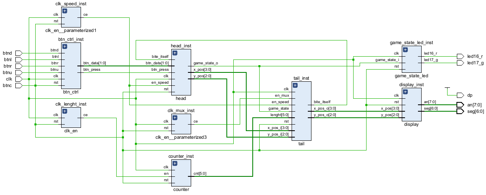

# - VHDL 7-Segment Snake -

<pre>                   
⠀⠀⠀⠀⠀⠀⠀⠀⠀⠀⠀⠀⢀⣀⣀⣀⣀⣀⣀⣀⣀⣀⠀⠀⠀⠀⠀⠀⠀⠀
⠀⠀⠀⠀⠀⠀⠀⠀⠀⣠⣶⣿⣿⣿⣿⣿⣿⣿⣿⣿⡉⠙⣻⣷⣶⣤⣀⠀⠀⠀
⠀⠀⠀⠀⠀⠀⠀⠀⣼⣿⣿⣿⡿⠋⠀⠀⠀⠀⢹⣿⣿⡟⠉⠉⠉⢻⡿⠀⠀⠀    University team project:
⠀⠀⠀⠀⠀⠀⠀⠰⣿⣿⣿⣿⠀⠀⠀⠀⠀⠀⠀⣿⣿⣇⠀⠀⠀⠈⠇⠀⠀⠀         Snake game logic written
⠀⠀⠀⠀⠀⠀⠀⠀⢿⣿⣿⣿⣷⣄⠀⠀⠀⠀⠀⠉⠛⠿⣷⣤⡤.⠀⠀⠀⠀⠀     in VHDL using a 7-segment
⠀⠀⠀⠀⠀⠀⠀⠀⠈⠻⣿⣿⣿⣿⣿⣶⣦⣤⣤⣀⣀⣀.⡀⠉⠀⠀⠀⠀⠀⠀      display output.
⠀⠀⠀⠀⠀⠀⠀⠀⠀⠀⠈⠙⠻⢿⣿⣿⣿⣿⣿⣿⣿⣿⣿⣿⣦⡀⠀⠀⠀⠀
⠀⠀⠀⢀⣀⣤⣄⣀⠀⠀⠀⠀⠀⠀⠀⠉⠉⠙⠛⠿⣿⣿⣿⣿⣿⣿⣦⠀⠀⠀   
⠀⠀⣰⣿⣿⣿⣿⣿⣷⣤⡀⠀⠀⠀⠀⠀⠀⠀⠀⠀⠀⠙⢿⣿⣿⣿⣿⣧  ⠀   Language: VHDL
⠀⠀⣿⣿⣿⠁⠀⠈⠙⢿⣿⣦⣄⠀⠀⠀⠀⠀⠀⠀⠀⠀⠀⢻⣿⣿⣿⣿⠀⠀     Development Environment: Vivado / VS Code   
⠀⠀⢿⣿⣿⣆⠀⠀⠀⠀⠈⠛⠿⣿⣶⣦⡤⠴⠀⠀⠀⠀⠀⣸⣿⣿⣿⡿⠀⠀     Target Board:  Nexys A7-50T 
⠀⠀⠈⢿⣿⣿⣷⣄⡀⠀⠀⠀⠀⠀⠀⠀⠀⠀⠀⠀⠀⠀⣰⣿⣿⣿⣿⠃⠀⠀         
⠀⠀⠀⠀⠙⢿⣿⣿⣿⣶⣦⣤⣀⣀⡀⠀⠀⠀⣀⣠⣴⣾⣿⣿⣿⡿⠃⠀⠀⠀        
⠀⠀⠀⠀⠀⠀⠈⠙⠻⠿⣿⣿⣿⣿⣿⣿⣿⣿⣿⣿⣿⣿⡿⠟⠋⠀⠀⠀⠀⠀   VUT Brno University of Technology 
⠀⠀⠀⠀⠀⠀⠀⠀⠀⠀⠀⠈⠉⠙⠛⠛⠛⠛⠛⠛⠉⠁⠀⠀⠀⠀⠀⠀⠀      
</pre>

---
## 👥 Team Members :
* [Balaniuk Artem](https://github.com/artembal27104-beep)
* [Dulesov Gleb](https://github.com/glebdulesov-alt)
* [Matros Tymofii](https://github.com/Tymofii-Matros)
* [Yeriemieiev Daniil](https://github.com/daniil-yeriemieiev)

---
> [!IMPORTANT]
> ### Our Goal :
> Implementation of the classic Snake game logic using VHDL on the Nexys A7-50T. The game uses an 8-digit 7-segment display as the play field.

---
## 🎥 Hardware Demonstration

[▶️ Click here to watch the Snake Game running on the Nexys A7-50T](https://github.com/user-attachments/assets/3c68e282-c8cd-4f05-858a-245eeb6fcd3a)

---
## 📌 Our Poster

---

## ⚙️ Base Functions :
* **Movement Control:** (BTNU, BTND, BTNL, BTNR) Buttons to control the snake.
* **Reset:** (BTNC) Central button to restart the game.
* **Scoring:** The snake grows in length as time passes, tracked by a counter.
* **Collision Detection:** Game ends when the snake bites its own tail or hits map borders.

---

## ⚡ Schematic ([Top Design](snake/snake.srcs/sources_1/new/snake_top.vhd)) :

### 🔌 RTL Design

---

## 🛠 Design Description :

### 1. ⏱️ Clock Domains ([`clk_en`](snake/snake.srcs/sources_1/imports/new/clk_en.vhd))
> [!NOTE]
> The main clock (100 MHz) is divided into 3 domains using `clk_en` modules.

| Port | Direction | Type | Description |
| :---: | :---: | :---: | :---: |
| `clk` | in | `std_logic` | Global clock |
| `rst` | in | `std_logic` | Global reset |
| `ce` | out | `std_logic` | Clock enable output |

#### Domain Parameters:
| Parameter | Target Signal | Time Period | Role |
| :---: | :---: | :---: | :---: |
| `G_MAX=100_000` | `sig_en_mux` | 1 ms | Switching between 8 anodes for dynamic display |
| `G_MAX=50_000_000` | `sig_en_speed` | 0.5 s | Update rate for snake's head movement |
| `G_MAX=100_000_000` | `sig_cnt_en` | 1 s | Interval to increase snake length |

---

### 2. 📊 Counter ([`counter`](snake/snake.srcs/sources_1/imports/new/counter.vhd))
> [!NOTE]
> Calculates the current length of the snake based on time intervals.

| Port | Direction | Type | Description |
| :--- | :---: | :--- | :--- |
| `clk` | in | `std_logic` | Global clock |
| `rst` | in | `std_logic` | Global reset |
| `en` | in | `std_logic` | Enable signal from `sig_cnt_en` |
| `cnt` | out | `std_logic_vector(G_BITS-1 downto 0)` | Current length value |

---

### 3. 🕹️ Button Control ([`btn_ctrl`](snake/snake.srcs/sources_1/new/btn_ctrl.vhd))
> [!NOTE]
> Role: User input processor.
>
> How it works: It captures physical button presses, debounces the signals to prevent ghost inputs, and translates them into a 2-bit directional code.
>
> Communication: Sends the `btn_press` trigger and `btn_data` direction vector directly to the `head` module to initiate a turn.

| Port | Direction | Type | Description |
| :--- | :---: | :--- | :--- |
| `clk` | in | `std_logic` | Global clock |
| `rst` | in | `std_logic` | Global reset |
| `btnu` | in | `std_logic` | Direction: Up |
| `btnl` | in | `std_logic` | Direction: Left |
| `btnd` | in | `std_logic` | Direction: Down |
| `btnr` | in | `std_logic` | Direction: Right |
| `btn_press` | out | `std_logic` | Triggered on any direction button press |
| `btn_data` | out | `std_logic_vector(1 downto 0)` | Direction data (00, 01, 10, 11) |

#### Button Control Testbench

[View Testbench Source Code](snake/snake.srcs/sim_1/imports/new/btn_ctrl_tb.vhd)

---

### 4. 🧠 Snake Head ([`head`](snake/snake.srcs/sources_1/new/head.vhd))
> [!NOTE]
> Role: The core movement and game state logic.
>
> How it works: It calculates the next coordinate of the snake's head based on the current direction and map boundaries. It moves strictly according to the `en_speed` tick. If it attempts an invalid move (e.g., hitting a wall) or receives a `bite_itself` signal, it transitions the game to a "Dead" state.
>
> Communication: Outputs its new coordinates (`x_pos`, `y_pos`) to the `tail` module and its survival status to the `game_state_led`.

| Port | Direction | Type | Description |
| :--- | :---: | :--- | :--- |
| `clk` | in | `std_logic` | Global clock |
| `rst` | in | `std_logic` | Global reset |
| `en_speed` | in | `std_logic` | Movement timing signal |
| `btn_press` | in | `std_logic` | Button activity trigger |
| `btn_data` | in | `std_logic_vector(1 downto 0)` | Current direction encoding |
| `bite_itself` | in | `std_logic` | Stop signal from Tail module |
| `x_pos` | out | `std_logic_vector(3 downto 0)` | Head X coordinate |
| `y_pos` | out | `std_logic_vector(2 downto 0)` | Head Y coordinate |
| `game_state_o` | out | `std_logic` | Status: '1' while alive, '0' if game over |

#### Snake Head Testbench

[View Testbench Source Code](snake/snake.srcs/sim_1/imports/new/head_tb.vhd)

---

### 5. 🔗 Snake Tail ([`tail`](snake/snake.srcs/sources_1/new/tail.vhd))
> [!NOTE]
> Role: Memory array (shift register) and collision detector.
>
> How it works: It maintains an internal array of historical head positions up to the maximum snake length (42). On every `en_speed` tick, it first checks if the incoming head coordinates match any existing body segment (up to the current lenght). If no collision is detected, the array shifts all coordinates one position down and stores the new head at index 0. Concurrently, using the fast `en_mux` signal, it cyclically loops through the valid array indices (0 to lenght - 1) and outputs one segment's coordinates at a time for dynamic display multiplexing.
>
> Communication: Receives incoming head coordinates (`x_pos_i`, `y_pos_i`), current length from the `counter`, and the game state. Outputs the `bite_itself` trigger back to the `head`, and sends sequential body coordinates (`x_pos_o`, `y_pos_o`) directly to the Display module.

> [!TIP]
> **Why is `SNAKE_MAX_LEN = 42`?**
> This constant represents the absolute maximum capacity of our virtual game board mapped across the 8-digit display. 
> * The first digit (`anode 0`) utilizes all **7** segments.
> * The remaining 7 digits (`anodes 1` to `7`) utilize **5** segments each (excluding one vertical path to form the grid layout).
> * Total playable positions: **7 + (5 * 7) = 42**.

| Port | Direction | Type | Description |
| :--- | :---: | :--- | :--- |
| `clk` | in | `std_logic` | Global clock |
| `rst` | in | `std_logic` | Global reset |
| `en_speed` | in | `std_logic` | Position update timing |
| `en_mux` | in | `std_logic` | Display multiplexing timing |
| `x_pos_i` | in | `std_logic_vector(3 downto 0)` | Head X input |
| `y_pos_i` | in | `std_logic_vector(2 downto 0)` | Head Y input |
| `lenght` | in | `std_logic_vector(5 downto 0)` | Current length from Counter |
| `x_pos_o` | out | `std_logic_vector(3 downto 0)` | Body segment X output |
| `y_pos_o` | out | `std_logic_vector(2 downto 0)` | Body segment Y output |
| `bite_itself` | out | `std_logic` | Active if head hits body |

#### Tail Snake Testbench

[View Testbench Source Code](snake/snake.srcs/sim_1/new/tail_tb.vhd)

---

### 6. 📟 Display Driver ([`display`](snake/snake.srcs/sources_1/new/display.vhd))
> [!NOTE]
> Role: Hardware abstraction layer and coordinate decoder for the 7-segment displays.
>
> How it works: It acts as a real-time decoder that translates logical grid coordinates (X: 0-8, Y: 0-4) into physical cathode/anode signals. The logic specifically maps X=0 to the right-side vertical segments (B, C) of the first digit (anode 0), and X=1 to the left-side vertical segments (F, E) of the same digit. Values of X > 1 are mapped to the remaining anodes. The Y coordinate determines which specific segment (A, F, G, E, D) lights up. Because this module constantly receives changing coordinates from the Tail's multiplexer at high speed (1ms), persistence of vision creates the illusion of a solid snake body spanning across all 8 digits.
>
> Communication: Driven entirely by the `tail` multiplexer outputs. It continuously drives the physical `an` (anode) and `seg` (cathode) pins on the Nexys A7 board.

| Port | Direction | Type | Description |
| :--- | :---: | :--- | :--- |
| `clk` | in | `std_logic` | Global clock |
| `rst` | in | `std_logic` | Global reset |
| `x_pos` | in | `std_logic_vector(3 downto 0)` | Coordinate to visualize |
| `y_pos` | in | `std_logic_vector(2 downto 0)` | Coordinate to visualize |
| `an` | out | `std_logic_vector(7 downto 0)` | Common Anode selection |
| `seg` | out | `std_logic_vector(6 downto 0)` | Segment Cathode selection |

#### Display Driver Testbench

[View Testbench Source Code](snake/snake.srcs/sim_1/imports/new/display_tb.vhd)

---

### 7. 🚥 Game State LED ([`game_state_led`](snake/snake.srcs/sources_1/new/game_state_led.vhd))
> [!NOTE]
> Role: Game status visualization.
>
> How it works: A simple combinational/sequential logic block that reads the game_state_i flag. If '1', it turns on the green LED. If '0', it turns on the red LED.
>
> Communication: Listens to the `head` module and drives the physical LED pins on the board.

| Port | Direction | Type | Description |
| :--- | :---: | :--- | :--- |
| `clk` | in | `std_logic` | Global clock |
| `rst` | in | `std_logic` | Global reset |
| `game_state_i` | in | `std_logic` | Input from Head module |
| `led17_g` | out | `std_logic` | Green LED output |
| `led16_r` | out | `std_logic` | Red LED output |

#### Snake state Testbench

[View Testbench Source Code](snake/snake.srcs/sim_1/imports/new/game_state_led_tb.vhd)

---

<pre> 
                                     Thanks for the visit!

                 ⢀⣠⣤⣶⣶⣿⣿⣿⣿⣿⣷⣶⣦⣄⡀⠀⠀⠀⠀⠀⠀⠀⠀⠀⠀⠀⠀⠀⠀⠀⠀ ⣀⣤⣶⣶⡿⠿⢿⣿⣶⣶⣤⣄⡀⠀⠀⠀⠀⠀⠀⠀
             ⢀⣠⣶⣿⣿⣿⣿⣿⣿⣿⣿⣿⣿⣿⣿⣿⣿⣿⣷⣄⡀⠀⠀⠀⠀⠀⠀⠀⠀⠀  ⠠⠞⠋⠉⠀⠀⠀  ⠀⠀ ⠀⠉⠛⢿⣿⣷⣄⠀⠀⠀⠀⠀
           ⣠⣾⣿⣿⣿⣿⠿⠛⠉⠁⠀⠀⠀⠀⠉⠙⠻⢿⣿⣿⣿⣿⣄⠀⠀⠀⠀⠀⠀⠀⠀⣀⣴⣶⣆⠀⠀⠀⠀⠀⠀⠀⠀⠀⠀⠀⠀⠀⠀ ⠈⠻⣿⣷⣄⠀⠀⠀
         ⣼⣿⣿⣿⡿⠋⠁⠀⠀⠀⠀⠀⠀⠀⠀⠀⠀⠀⠀⠙⢿⣿⣿⣿⣷⡀⠀⠀⠀⢀⣶⣿⣿⣿⣿⠏⠀⠀⠀⠀⠀⠀⠀⠀⠀⠀⠀⠀⠀⠀⠀⠀   ⠘⣿⣿⣧⠀⠀
        ⣼⣿⣿⣿⡟⠀⠀⠀⠀⠀⠀⠀⠀⠀⠀⠀⠀⠀⠀⠀⠀⠀⠙⣿⣿⣿⣿⣄⠀⠀⣿⣿⣿⣿⣿⡟⠀⠀⠀⠀⠀⠀⠀⠀⠀⠀⠀ ⠀⠀⠀⠀⠀⠀ ⠀  ⠘⣿⣿⣧⠀
       ⢸⣿⣿⣿⡟⠀⠀⠀⠀⠀⠀⠀⠀⠀⠀⠀⠀⠀⠀⠀⠀⠀⠀⠀⠈⢿⣿⣿⣿⢂⣾⣿⣿⣿⠿⠛⠀⠀⠀⠀⠀⠀⠀⠀⠀⠀⠀⠀⠀⠀⠀  ⠀⠀ ⠀⠀  ⢸⣿⣿⡄
       ⣿⣿⣿⣿⠁⠀⠀⠀⠀⠀⠀⠀⠀⠀⠀⠀⠀⠀⠀⠀⠀⠀⠀⠀⠀⠀⢻⡿⢡⣿⣿⣿⡿⠃⠀⠀⠀⠀⠀⠀⠀⠀⠀⠀⠀⠀⠀⠀⠀⠀⠀  ⠀⠀⠀⠀⠀  ⠈⣿⣿⡇
       ⣿⣿⣿⣿⠀⠀⠀⠀⠀⠀⠀⠀⠀⠀⠀⠀⠀⠀⠀⠀⠀⠀⠀⠀⠀⠀⠀⣱⣿⣿⣿⡿⡁⠀⠀⠀⠀⠀⠀⠀⠀⠀⠀⠀⠀⠀⠀⠀⠀⠀    ⠀⠀⠀⠀   ⢠⣿⣿⡇
       ⢿⣿⣿⣿⡄⠀⠀⠀⠀⠀⠀⠀⠀⠀⠀⠀⠀⠀⠀⠀⠀⠀⠀⠀⠀⠀⣼⣿⣿⣿⡟⣴⣿⣦⠀⠀⠀⠀⠀⠀⠀⠀⠀⠀⠀⠀⠀⠀⠀⠀     ⠀⠀⠀⠀ ⣸⣿⣿⡇
       ⠸⣿⣿⣿⣷⠀⠀⠀⠀⠀⠀⠀⠀⠀⠀⠀⠀⠀⠀⠀⠀⠀⠀⠀⢀⣾⣿⣿⣿⠏⢸⣿⣿⣿⣷⡀⠀⠀⠀⠀⠀⠀⠀⠀⠀⠀⠀⠀⠀⠀⠀  ⠀⠀⠀⠀ ⣰⣿⣿⣿⠁
        ⢻⣿⣿⣿⣷⡀⠀⠀⠀⠀⠀⠀⠀⠀⠀⠀⠀⠀⠀⠀⠀⠀⣠⣿⣿⣿⡿⠃⠀⠀⠹⣿⣿⣿⣿⣆⠀⠀⠀⠀⠀⠀⠀⠀⠀⠀⠀⠀⠀⠀  ⠀⠀⠀ ⣴⣿⣿⣿⠃⠀
         ⠹⣿⣿⣿⣿⣦⡀⠀⠀⠀⠀⠀⠀⠀⠀⠀⠀⠀⢀⣠⣾⣿⣿⣿⠟⠁⠀⠀⠀⠀⠈⢻⣿⣿⣿⣷⣄⡀⠀⠀⠀⠀⠀⠀⠀⠀⠀  ⠀⠀⢀⣠⣾⣿⣿⡿⠃⠀⠀
          ⠈⠻⣿⣿⣿⣿⣶⣤⣀⣀⠀⠀⠀⣀⣀⣤⣶⣿⣿⣿⣿⡿⠁⠀⠀⠀⠀⠀⠀⠀⠀⠙⢿⣿⣿⣿⣿⣶⣤⣀⣀⠀⠀⠀⢀⣀⣤⣶⣿⣿⣿⣿⠟⠁⠀⠀⠀
            ⠈⠛⢿⣿⣿⣿⣿⣿⣿⣿⣿⣿⣿⣿⣿⣿⡿⠟⠁⠀⠀⠀⠀⠀⠀⠀⠀⠀⠀⠀⠀⠈⠻⢿⣿⣿⣿⣿⣿⣿⣿⣿⣿⣿⣿⣿⣿⡿⠛⠁⠀⠀⠀⠀⠀
                ⠈⠉⠛⠻⠿⠿⠿⠿⠿⠟⠛⠉⠁⠀⠀⠀⠀⠀⠀⠀⠀⠀⠀⠀⠀⠀ ⠀⠀⠀⠀⠀⠉⠛⠻⠿⢿⣿⣿⣿⠿⠿⠟⠋⠁⠀⠀⠀⠀
                
</pre>
