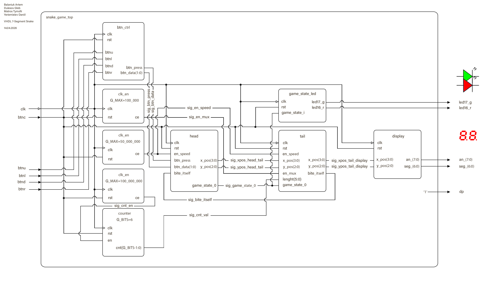
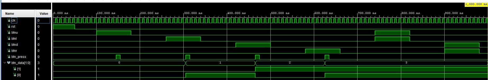
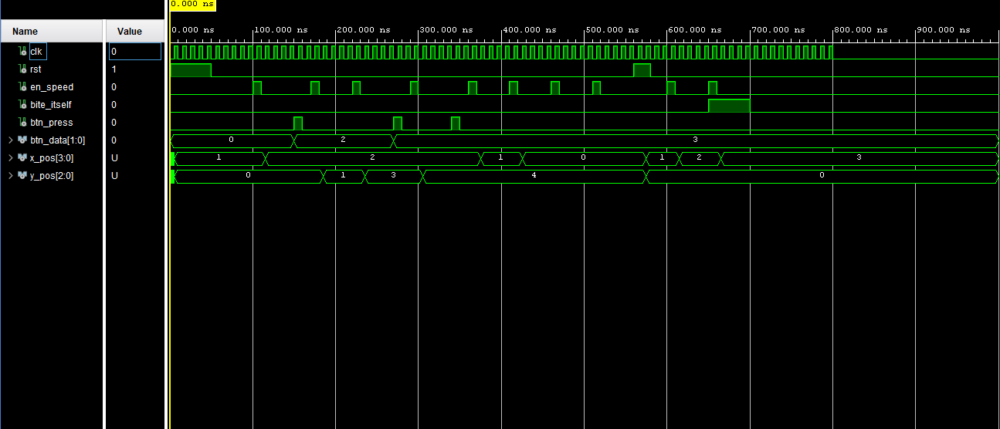
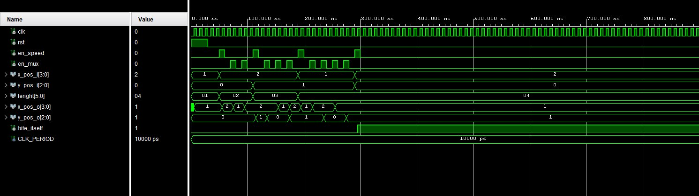
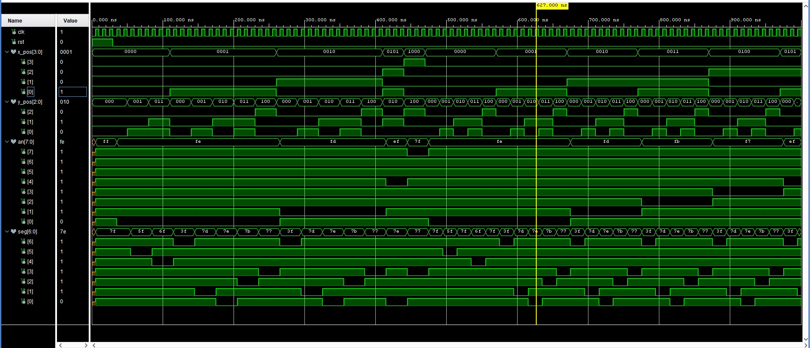
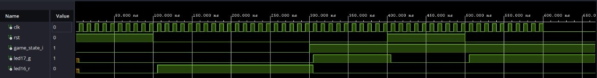

# - VHDL 7-Segment Snake -

<pre>                   
⠀⠀⠀⠀⠀⠀⠀⠀⠀⠀⠀⠀⢀⣀⣀⣀⣀⣀⣀⣀⣀⣀⠀⠀⠀⠀⠀⠀⠀⠀
⠀⠀⠀⠀⠀⠀⠀⠀⠀⣠⣶⣿⣿⣿⣿⣿⣿⣿⣿⣿⡉⠙⣻⣷⣶⣤⣀⠀⠀⠀
⠀⠀⠀⠀⠀⠀⠀⠀⣼⣿⣿⣿⡿⠋⠀⠀⠀⠀⢹⣿⣿⡟⠉⠉⠉⢻⡿⠀⠀⠀    University team project:
⠀⠀⠀⠀⠀⠀⠀⠰⣿⣿⣿⣿⠀⠀⠀⠀⠀⠀⠀⣿⣿⣇⠀⠀⠀⠈⠇⠀⠀⠀         Snake game logic written
⠀⠀⠀⠀⠀⠀⠀⠀⢿⣿⣿⣿⣷⣄⠀⠀⠀⠀⠀⠉⠛⠿⣷⣤⡤.⠀⠀⠀⠀⠀     in VHDL using a 7-segment
⠀⠀⠀⠀⠀⠀⠀⠀⠈⠻⣿⣿⣿⣿⣿⣶⣦⣤⣤⣀⣀⣀.⡀⠉⠀⠀⠀⠀⠀⠀      display output.
⠀⠀⠀⠀⠀⠀⠀⠀⠀⠀⠈⠙⠻⢿⣿⣿⣿⣿⣿⣿⣿⣿⣿⣿⣦⡀⠀⠀⠀⠀
⠀⠀⠀⢀⣀⣤⣄⣀⠀⠀⠀⠀⠀⠀⠀⠉⠉⠙⠛⠿⣿⣿⣿⣿⣿⣿⣦⠀⠀⠀   
⠀⠀⣰⣿⣿⣿⣿⣿⣷⣤⡀⠀⠀⠀⠀⠀⠀⠀⠀⠀⠀⠙⢿⣿⣿⣿⣿⣧  ⠀   Language: VHDL
⠀⠀⣿⣿⣿⠁⠀⠈⠙⢿⣿⣦⣄⠀⠀⠀⠀⠀⠀⠀⠀⠀⠀⢻⣿⣿⣿⣿⠀⠀     Development Environment: Vivado / VS Code   
⠀⠀⢿⣿⣿⣆⠀⠀⠀⠀⠈⠛⠿⣿⣶⣦⡤⠴⠀⠀⠀⠀⠀⣸⣿⣿⣿⡿⠀⠀     Target Board:  Nexys A7-50T 
⠀⠀⠈⢿⣿⣿⣷⣄⡀⠀⠀⠀⠀⠀⠀⠀⠀⠀⠀⠀⠀⠀⣰⣿⣿⣿⣿⠃⠀⠀         
⠀⠀⠀⠀⠙⢿⣿⣿⣿⣶⣦⣤⣀⣀⡀⠀⠀⠀⣀⣠⣴⣾⣿⣿⣿⡿⠃⠀⠀⠀        
⠀⠀⠀⠀⠀⠀⠈⠙⠻⠿⣿⣿⣿⣿⣿⣿⣿⣿⣿⣿⣿⣿⡿⠟⠋⠀⠀⠀⠀⠀   VUT Brno University of Technology 
⠀⠀⠀⠀⠀⠀⠀⠀⠀⠀⠀⠈⠉⠙⠛⠛⠛⠛⠛⠛⠉⠁⠀⠀⠀⠀⠀⠀⠀      
</pre>

---
## Team Members :
* [Balaniuk Artem](https://github.com/artembal27104-beep)
* [Dulesov Gleb](https://github.com/glebdulesov-alt)
* [Matros Tymofii](https://github.com/Tymofii-Matros)
* [Yeriemieiev Daniil](https://github.com/daniil-yeriemieiev)

---
> [!IMPORTANT]
> ### Our Goal :
> Implementation of the classic Snake game logic using VHDL on the Nexys A7-50T. The game uses an 8-digit 7-segment display as the play field.

---

## Base Functions :
* **Movement Control:** (BTNU, BTND, BTNL, BTNR) Buttons to control the snake.
* **Reset:** (BTNC) Central button to restart the game.
* **Scoring:** The snake grows in length as time passes, tracked by a counter.
* **Collision Detection:** Game ends when the snake bites its own tail or hits map borders.

---

## Schematic:

> [!WARNING]
> The scheme will be further refined, and all simulation results will be added at a later date. 

---

## Design Description :

### 1. Clock Domains ([`clk_en`](snake/snake.srcs/sources_1/imports/new/clk_en.vhd))
> [!NOTE]
> The main clock (100 MHz) is divided into 3 domains using `clk_en` modules.

| Port | Direction | Type | Description |
| :---: | :---: | :---: | :---: |
| `clk` | in | `std_logic` | Global clock |
| `rst` | in | `std_logic` | Global reset |
| `ce` | out | `std_logic` | Clock enable output |

#### Domain Parameters:
| Parameter | Target Signal | Time Period | Role |
| :---: | :---: | :---: | :---: |
| `G_MAX=100_000` | `sig_en_mux` | 1 ms | Switching between 8 anodes for dynamic display |
| `G_MAX=50_000_000` | `sig_en_speed` | 0.5 s | Update rate for snake's head movement |
| `G_MAX=100_000_000` | `sig_cnt_en` | 1 s | Interval to increase snake length |

---

### 2. Counter ([`counter`](snake/snake.srcs/sources_1/imports/new/counter.vhd))
> [!NOTE]
> Calculates the current length of the snake based on time intervals.

| Port | Direction | Type | Description |
| :--- | :---: | :--- | :--- |
| `clk` | in | `std_logic` | Global clock |
| `rst` | in | `std_logic` | Global reset |
| `en` | in | `std_logic` | Enable signal from `sig_cnt_en` |
| `cnt` | out | `std_logic_vector(G_BITS-1 downto 0)` | Current length value |

---

### 3. Button Control ([`btn_ctrl`](snake/snake.srcs/sources_1/new/btn_ctrl.vhd))
| Port | Direction | Type | Description |
| :--- | :---: | :--- | :--- |
| `clk` | in | `std_logic` | Global clock |
| `rst` | in | `std_logic` | Global reset |
| `btnu` | in | `std_logic` | Direction: Up |
| `btnl` | in | `std_logic` | Direction: Left |
| `btnd` | in | `std_logic` | Direction: Down |
| `btnr` | in | `std_logic` | Direction: Right |
| `btn_press` | out | `std_logic` | Triggered on any direction button press |
| `btn_data` | out | `std_logic_vector(1 downto 0)` | Direction data (00, 01, 10, 11) |

#### Button Control Testbench

---

### 4. Snake Head ([`head`](snake/snake.srcs/sources_1/new/head.vhd))
| Port | Direction | Type | Description |
| :--- | :---: | :--- | :--- |
| `clk` | in | `std_logic` | Global clock |
| `rst` | in | `std_logic` | Global reset |
| `en_speed` | in | `std_logic` | Movement timing signal |
| `btn_press` | in | `std_logic` | Button activity trigger |
| `btn_data` | in | `std_logic_vector(1 downto 0)` | Current direction encoding |
| `bite_itself` | in | `std_logic` | Stop signal from Tail module |
| `x_pos` | out | `std_logic_vector(3 downto 0)` | Head X coordinate |
| `y_pos` | out | `std_logic_vector(2 downto 0)` | Head Y coordinate |
| `game_state_o` | out | `std_logic` | Status: '1' while alive, '0' if game over |

#### Snake Head Testbench

---

### 5. Snake Tail ([`tail`](snake/snake.srcs/sources_1/new/tail.vhd))
> [!NOTE]
> Manages body segments memory and detects self-collision.

| Port | Direction | Type | Description |
| :--- | :---: | :--- | :--- |
| `clk` | in | `std_logic` | Global clock |
| `rst` | in | `std_logic` | Global reset |
| `en_speed` | in | `std_logic` | Position update timing |
| `en_mux` | in | `std_logic` | Display multiplexing timing |
| `x_pos_i` | in | `std_logic_vector(3 downto 0)` | Head X input |
| `y_pos_i` | in | `std_logic_vector(2 downto 0)` | Head Y input |
| `lenght` | in | `std_logic_vector(5 downto 0)` | Current length from Counter |
| `x_pos_o` | out | `std_logic_vector(3 downto 0)` | Body segment X output |
| `y_pos_o` | out | `std_logic_vector(2 downto 0)` | Body segment Y output |
| `bite_itself` | out | `std_logic` | Active if head hits body |

#### Tail Snake Testbench

---

### 6. Display Driver ([`display`](snake/snake.srcs/sources_1/new/display.vhd))

> [!NOTE]
> The circuit controls the 7-segment display by picking one digit (x_pos) and lighting a specific segment on it (y_pos). It repeats this fast enough so human eye sees solid thing. The `an` signal selects the digit, and the `seg` signal selects which line to light.

| Port | Direction | Type | Description |
| :--- | :---: | :--- | :--- |
| `clk` | in | `std_logic` | Global clock |
| `rst` | in | `std_logic` | Global reset |
| `x_pos` | in | `std_logic_vector(3 downto 0)` | Coordinate to visualize |
| `y_pos` | in | `std_logic_vector(2 downto 0)` | Coordinate to visualize |
| `an` | out | `std_logic_vector(7 downto 0)` | Common Anode selection |
| `seg` | out | `std_logic_vector(6 downto 0)` | Segment Cathode selection |

#### Display Driver Testbench

---

### 7. Game State LED ([`game_state_led`](snake/snake.srcs/sources_1/new/game_state_led.vhd))
> [!NOTE]
> Status indicator using RGB LEDs: **Green** (Running), **Red** (Game Over).

| Port | Direction | Type | Description |
| :--- | :---: | :--- | :--- |
| `clk` | in | `std_logic` | Global clock |
| `rst` | in | `std_logic` | Global reset |
| `game_state_i` | in | `std_logic` | Input from Head module |
| `led17_g` | out | `std_logic` | Green LED output |
| `led16_r` | out | `std_logic` | Red LED output |

#### Snake state Testbench

---

<pre> 
                                     Thanks for the visit!

             ⢀⣠⣤⣶⣶⣿⣿⣿⣿⣿⣷⣶⣦⣄⡀⠀⠀⠀⠀⠀⠀⠀⠀⠀⠀⠀⠀⠀⠀⠀⠀⠀⠀⣀⣤⣶⣶⡿⠿⢿⣿⣶⣶⣤⣄⡀⠀⠀⠀⠀⠀⠀⠀
            ⢀⣠⣶⣿⣿⣿⣿⣿⣿⣿⣿⣿⣿⣿⣿⣿⣿⣿⣷⣄⡀⠀⠀⠀⠀⠀⠀⠀⠀⠀  ⠠⠞⠋⠉⠀⠀⠀  ⠀⠀⠀⠉⠛⢿⣿⣷⣄⠀⠀⠀⠀⠀
          ⣠⣾⣿⣿⣿⣿⠿⠛⠉⠁⠀⠀⠀⠀⠉⠙⠻⢿⣿⣿⣿⣿⣄⠀⠀⠀⠀⠀⠀⠀⠀⣀⣴⣶⣆⠀⠀⠀⠀⠀⠀⠀⠀⠀⠀⠀⠀⠀⠀⠈⠻⣿⣷⣄⠀⠀⠀
        ⣼⣿⣿⣿⡿⠋⠁⠀⠀⠀⠀⠀⠀⠀⠀⠀⠀⠀⠀⠙⢿⣿⣿⣿⣷⡀⠀⠀⠀⢀⣶⣿⣿⣿⣿⠏⠀⠀⠀⠀⠀⠀⠀⠀⠀⠀⠀⠀⠀⠀⠀⠀⠘⣿⣿⣧⠀⠀
       ⣼⣿⣿⣿⡟⠀⠀⠀⠀⠀⠀⠀⠀⠀⠀⠀⠀⠀⠀⠀⠀⠀⠙⣿⣿⣿⣿⣄⠀⠀⣿⣿⣿⣿⣿⡟⠀⠀⠀⠀⠀⠀⠀⠀⠀⠀⠀ ⠀⠀⠀⠀⠀⠀⠀⠘⣿⣿⣧⠀
       ⢸⣿⣿⣿⡟⠀⠀⠀⠀⠀⠀⠀⠀⠀⠀⠀⠀⠀⠀⠀⠀⠀⠀⠀⠈⢿⣿⣿⣿⢂⣾⣿⣿⣿⠿⠛⠀⠀⠀⠀⠀⠀⠀⠀⠀⠀⠀⠀⠀⠀⠀  ⠀⠀⠀⠀⠀⢸⣿⣿⡄
       ⣿⣿⣿⣿⠁⠀⠀⠀⠀⠀⠀⠀⠀⠀⠀⠀⠀⠀⠀⠀⠀⠀⠀⠀⠀⠀⢻⡿⢡⣿⣿⣿⡿⠃⠀⠀⠀⠀⠀⠀⠀⠀⠀⠀⠀⠀⠀⠀⠀⠀⠀  ⠀⠀⠀⠀⠀⠈⣿⣿⡇
       ⣿⣿⣿⣿⠀⠀⠀⠀⠀⠀⠀⠀⠀⠀⠀⠀⠀⠀⠀⠀⠀⠀⠀⠀⠀⠀⠀⣱⣿⣿⣿⡿⡁⠀⠀⠀⠀⠀⠀⠀⠀⠀⠀⠀⠀⠀⠀⠀⠀⠀    ⠀⠀⠀⠀⢠⣿⣿⡇
       ⢿⣿⣿⣿⡄⠀⠀⠀⠀⠀⠀⠀⠀⠀⠀⠀⠀⠀⠀⠀⠀⠀⠀⠀⠀⠀⣼⣿⣿⣿⡟⣴⣿⣦⠀⠀⠀⠀⠀⠀⠀⠀⠀⠀⠀⠀⠀⠀⠀⠀     ⠀⠀⠀⠀⣸⣿⣿⡇
       ⠸⣿⣿⣿⣷⠀⠀⠀⠀⠀⠀⠀⠀⠀⠀⠀⠀⠀⠀⠀⠀⠀⠀⠀⢀⣾⣿⣿⣿⠏⢸⣿⣿⣿⣷⡀⠀⠀⠀⠀⠀⠀⠀⠀⠀⠀⠀⠀⠀⠀⠀  ⠀⠀⠀⠀⣰⣿⣿⣿⠁
        ⢻⣿⣿⣿⣷⡀⠀⠀⠀⠀⠀⠀⠀⠀⠀⠀⠀⠀⠀⠀⠀⠀⣠⣿⣿⣿⡿⠃⠀⠀⠹⣿⣿⣿⣿⣆⠀⠀⠀⠀⠀⠀⠀⠀⠀⠀⠀⠀⠀⠀  ⠀⠀⠀⣴⣿⣿⣿⠃⠀
         ⠹⣿⣿⣿⣿⣦⡀⠀⠀⠀⠀⠀⠀⠀⠀⠀⠀⠀⢀⣠⣾⣿⣿⣿⠟⠁⠀⠀⠀⠀⠈⢻⣿⣿⣿⣷⣄⡀⠀⠀⠀⠀⠀⠀⠀⠀⠀  ⠀⠀⢀⣠⣾⣿⣿⡿⠃⠀⠀
          ⠈⠻⣿⣿⣿⣿⣶⣤⣀⣀⠀⠀⠀⣀⣀⣤⣶⣿⣿⣿⣿⡿⠁⠀⠀⠀⠀⠀⠀⠀⠀⠙⢿⣿⣿⣿⣿⣶⣤⣀⣀⠀⠀⠀⢀⣀⣤⣶⣿⣿⣿⣿⠟⠁⠀⠀⠀
            ⠈⠛⢿⣿⣿⣿⣿⣿⣿⣿⣿⣿⣿⣿⣿⣿⡿⠟⠁⠀⠀⠀⠀⠀⠀⠀⠀⠀⠀⠀⠀⠈⠻⢿⣿⣿⣿⣿⣿⣿⣿⣿⣿⣿⣿⣿⣿⡿⠛⠁⠀⠀⠀⠀⠀
                  ⠈⠉⠛⠻⠿⠿⠿⠿⠿⠟⠛⠉⠁⠀⠀⠀⠀⠀⠀⠀⠀⠀⠀⠀⠀⠀ ⠀⠀⠀⠀⠀⠉⠛⠻⠿⢿⣿⣿⣿⠿⠿⠟⠋⠁⠀⠀⠀⠀
                
</pre>